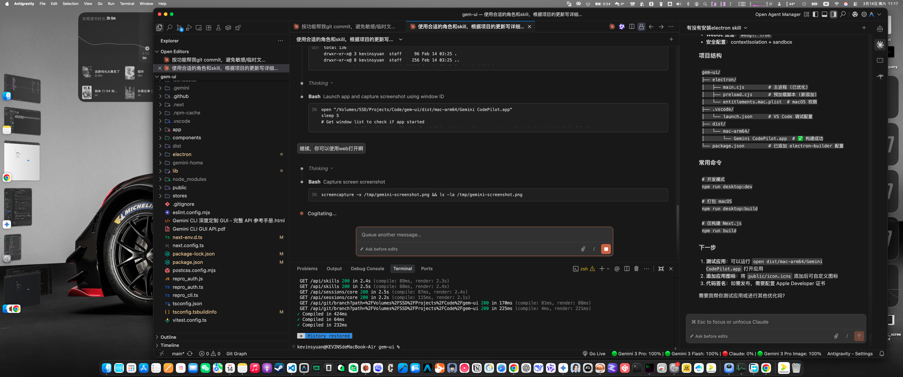

<div align="center">
  
  <h1>GGBond</h1>
</div>

<p align="center">
  <a href="./README.md">English</a> · <a href="./README.zh-CN.md">简体中文</a>
</p>

<p align="center">
  <a href="https://github.com/Kevoyuan/GGBond/releases">
    
  </a>
  <a href="https://github.com/Kevoyuan/GGBond/blob/main/LICENSE">
    
  </a>
  
  
</p>

<p align="center">
  
</p>

GGBond 是一个基于 Gemini CLI 的桌面 AI 编程工作台，当前已迁移到 Tauri + Rust 运行时。

## 关键能力

- Rust PTY 流式终端（`portable-pty`），命令执行更稳定。
- AI 工作流可视化：分支图谱 + 时间线 + Plan Mode 进度。
- 工作区优先的会话管理，配合本地 SQLite 持久化。
- Tauri 体积优化发布，桌面包更轻量。

## 架构说明

- 前端：Next.js + React，作为桌面 WebView UI。
- 桌面壳：Tauri 2。
- 安装版运行时：内置 Next standalone server（保证 `/api/*` 与 `tauri dev` 行为一致）。
- 后端命令：Rust（`src-tauri`）通过 `invoke` 暴露。
- 终端链路：`pty-stream-*` 事件流，支持运行/输入/停止。

## 技术栈

| 模块 | 技术 |
|---|---|
| 桌面运行时 | Tauri 2 |
| 前端 | Next.js 15 + React 19 |
| 语言 | TypeScript + Rust |
| 终端 | `xterm` + Rust `portable-pty` |
| 存储 | `better-sqlite3` |
| UI | Tailwind CSS 4 + Framer Motion |

## 安装

从 [Releases](https://github.com/Kevoyuan/GGBond/releases) 下载：

- macOS（Apple Silicon）：`ggbond_<version>_aarch64.dmg`
- Windows 安装包：`ggbond_<version>_x64-setup.exe`（具体格式可能为 NSIS/MSI）

官方发布包会进行代码签名；当 CI 已配置 Apple 凭据时，macOS 包会自动完成公证，终端用户不应再需要手动执行 `xattr`。

## 开发

```bash
git clone https://github.com/Kevoyuan/GGBond.git
cd GGBond
npm install

# Web UI 开发
npm run dev

# Tauri 桌面开发
npm run tauri dev
```

## 构建

```bash
# 构建前端并准备 Tauri 分发目录
npm run build:tauri-dist

# 构建当前系统对应桌面安装包
npm run tauri build
```

## 项目结构

```text
GGBond/
├── app/                 # Next.js 页面与 API 路由
├── components/          # UI 组件
├── lib/                 # 前端/运行时服务
├── scripts/             # 构建与工具脚本
├── src-tauri/           # Rust 运行时与 Tauri 配置
└── docs/                # 维护与发布文档
```

## 许可证

MIT
