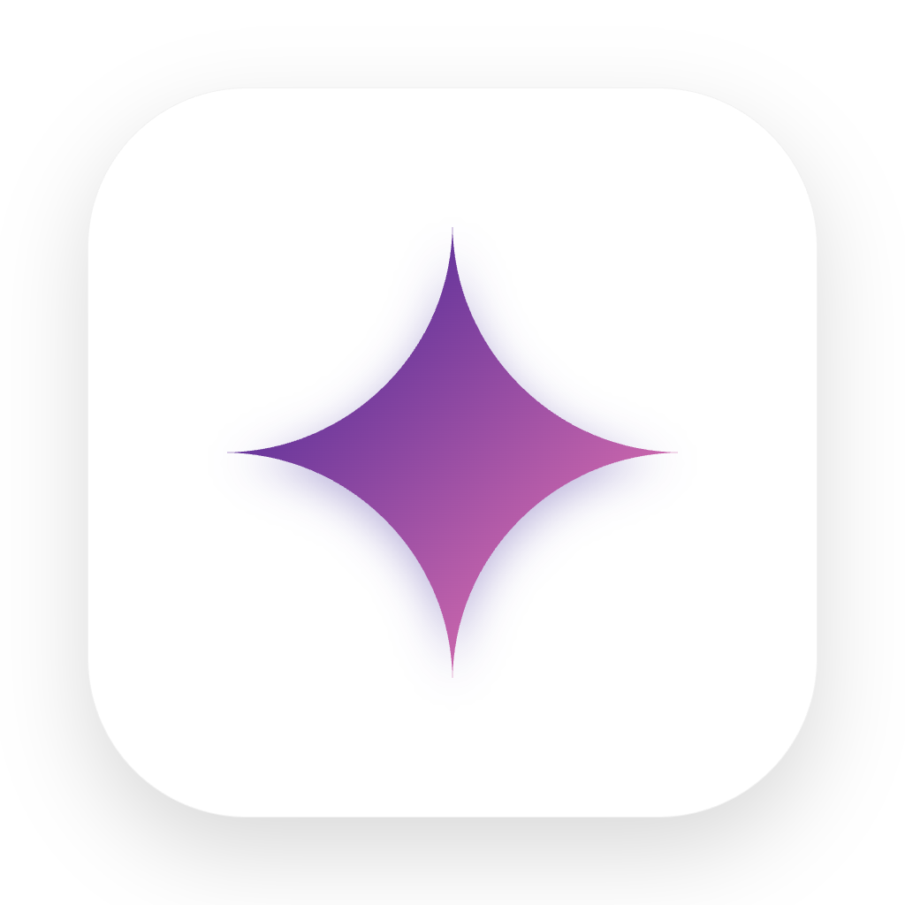
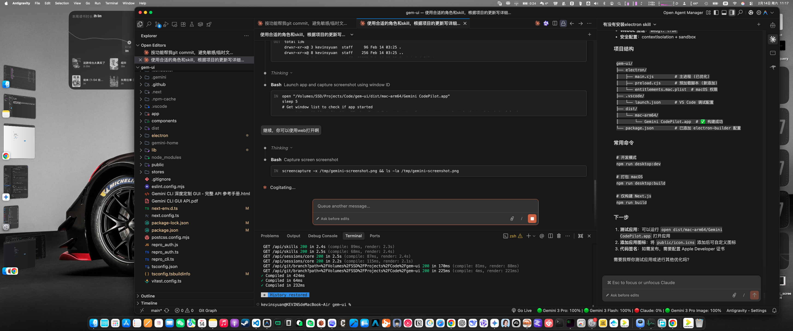

<div align="center">
  
  <h1>GGBond 🕶️</h1>
  <p><strong>你的专属桌面 AI 编程座舱。由 Gemini 与 Tauri 强力驱动。</strong></p>
</div>

<p align="center">
  <a href="./README.md">English</a> · <a href="./README.zh-CN.md">简体中文</a>
</p>

<p align="center">
  <a href="https://github.com/Kevoyuan/GGBond/releases">
    
  </a>
  <a href="https://www.npmjs.com/package/@google/gemini-cli-core">
    
  </a>
  <a href="https://github.com/Kevoyuan/GGBond/blob/main/LICENSE">
    
  </a>
  
  
</p>

<p align="center">
  
</p>

GGBond 不仅仅是一个终端套壳——它是一个基于 [Gemini CLI](https://github.com/google-gemini/gemini-cli)（[GitHub Repo](https://github.com/google-gemini/gemini-cli) | [官网](https://www.npmjs.com/package/@google/gemini-cli)）构建的**全功能桌面 AI 编程工作台**，当前已全面升级至 Tauri + Rust 运行时。专为注重速度、上下文管理和智能工作流的开发者打造。

---

## ✨ 核心特性

*   ⚡️ **极致终端体验**：基于 Rust PTY（`portable-pty`）的流式终端，响应迅速，命令执行稳定无缝。
*   🧠 **可视化 AI 工作流**：引入分支图谱、时间线记录以及专注任务的 **Plan Mode** 进度面板，让 AI 思考过程一目了然。
*   🔒 **工作区优先级**：配合本地 SQLite 数据库进行持久化存储。无缝切换项目，不再丢失 AI 会话上下文。
*   📦 **轻量级内核**：得益于 Tauri 的卓越优化，安装包极小，占用资源极低，却能提供最硬核的桌面级性能。

## 🏗 架构设计

GGBond 完美融合了现代 Web 技术与底层原生性能：

*   **前端视图**：Next.js 15 + React 19，作为桌面 WebView 的强劲驱动力。
*   **桌面外壳**：Tauri 2，为桌面端量身定制。
*   **独立服务器**：安装版内置 Next standalone server，确保 `/api/*` 环境与本地开发（`tauri dev`）行为完全一致。
*   **原生通信**：基于 Rust (`src-tauri`) 的安全命令桥（`invoke`）处理底层调用。
*   **终端链路**：`pty-stream-*` 事件流模型，高效支持终端的运行、输入拦截与中断控制。

## 🛠 技术栈概览

| 模块 | 使用技术 |
| :--- | :--- |
| **桌面核心** |   |
| **前端应用** |   |
| **界面样式** |   |
| **终端引擎** | `xterm.js` + `portable-pty` |
| **数据持久化**| `better-sqlite3` |

## 🚀 快速开始

前往 [Releases 页面](https://github.com/Kevoyuan/GGBond/releases) 下载最新版本：

*   🍏 **macOS (Apple Silicon)**：`ggbond_<version>_aarch64.dmg`
*   🪟 **Windows**：`ggbond_<version>_x64-setup.exe`

> **提示**：官方发布包均已进行代码签名。macOS 包在 CI 中会自动完成 Apple 公证，终端用户下载后即可直接运行，无需再手动执行繁杂的 `xattr` 解除隔离命令。

## 💻 本地开发

想亲自动手改造 GGBond？请按照以下步骤搭建环境：

```bash
git clone https://github.com/Kevoyuan/GGBond.git
cd GGBond
npm install

# 启动 Web UI 开发环境
npm run dev

# 启动 Tauri 桌面应用开发环境
npm run tauri dev
```

## 📦 打包构建

```bash
# 1. 编译前端并输出 Tauri 可读取的分发目录
npm run build:tauri-dist

# 2. 为当前操作系统构建桌面安装包
npm run tauri build
```

## 📂 项目结构

```text
GGBond/
├── app/                 # Next.js 页面与接口路由
├── components/          # React 复用 UI 组件
├── lib/                 # 前端状态与运行时服务层
├── scripts/             # 构建流程与工程化脚本
├── src-tauri/           # Rust 原生代码与 Tauri 配置
└── docs/                # 操作手册与发布文档
```

## 📄 许可证

本项目基于 [MIT 许可证](./LICENSE) 开源。享受更优雅的 AI 编程体验吧！
